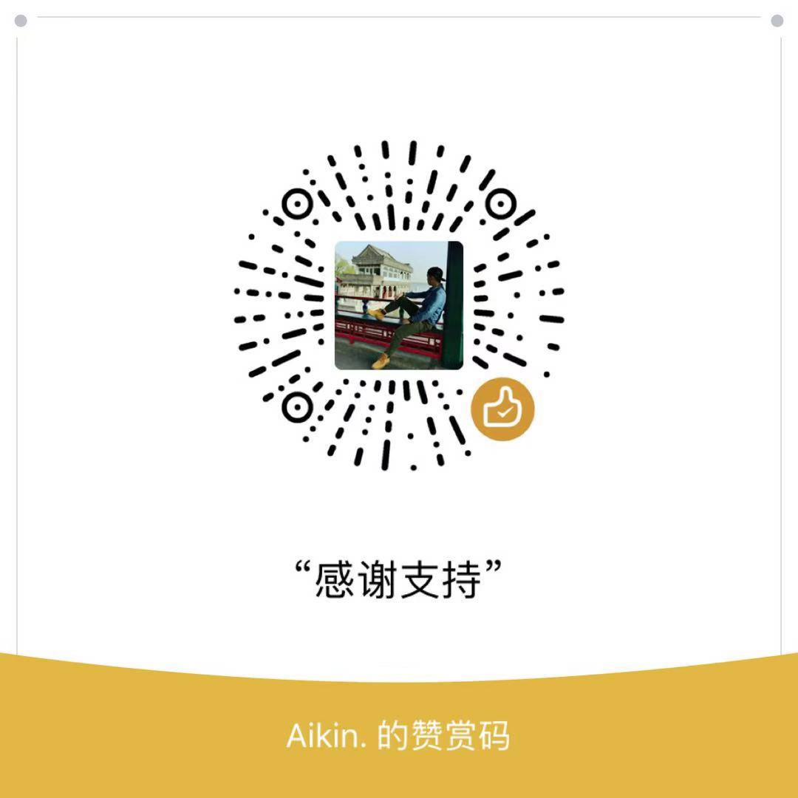

# meetingRoomApp(会议室预订助手）
一个微信小程序


> 开发工具: **微信Web开发者工具** [传送门](https://developers.weixin.qq.com/miniprogram/dev/devtools/download.html)

### 项目结构
```Javascript
|--api              //接口配置文件
|--images           //存放项目图片
|--pages            //存放页面
|--utils            //存放方法等其他数据
|--app.js           //小程序公共方法
|--app.json         //小程序公共设置
|--app.wxss         //小程序公共样式表
|--weui.wxss        //weui样式
|--README.md        //说明文档
```

### 使用技术
- `MINA` 微信小程序框架 [传送门](https://developers.weixin.qq.com/miniprogram/dev/framework/MINA.html/)
- `WeUI` 一套同微信原生视觉体验一致的基础样式库 [传送门](https://weui.io/)

### 运行截图（一共13个页面，展示部分截图）


### 运行
git clone 该项目到本地用微信Web开发者工具打开即可

PS:打开项目需要小程序id，注册一个小程序就可以了 [传送门](https://mp.weixin.qq.com/cgi-bin/wx)

### 如果觉的有帮助的话，可以赞赏下小编喔，感谢支持
有疑问可以留言issue或者邮箱给我喔，邮箱是348194283@qq.com


未经允许请勿商用，如需商用请先联系本人，否则将追究法律责任
